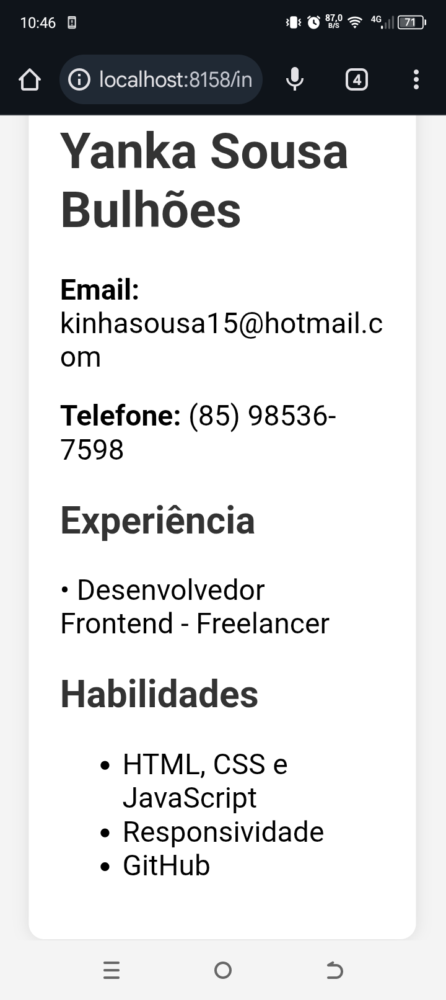

PT-BR: 
Fiz alguns ajustes como renomear o arquivo JS, configurar ele na página HTML e tornar o CSS responsivo para celular.
Este é um projeto de currículo online criado com HTML, CSS e JavaScript. A página exibe informações como nome, email, telefone, experiência e habilidades. O JavaScript é utilizado apenas para mostrar dados no console, como nome, idade e ano de nascimento. O layout foi adaptado para funcionar bem em dispositivos móveis.

EN: 
I made some adjustments such as renaming the JS file, linking it to the HTML page, and making the CSS responsive for mobile.
This is an online résumé project built with HTML, CSS, and JavaScript. The page displays information such as name, email, phone number, experience, and skills. JavaScript is used only to show data in the console, such as name, age, and year of birth. The layout was adapted to work well on mobile devices.

Aqui o print do projeto 

